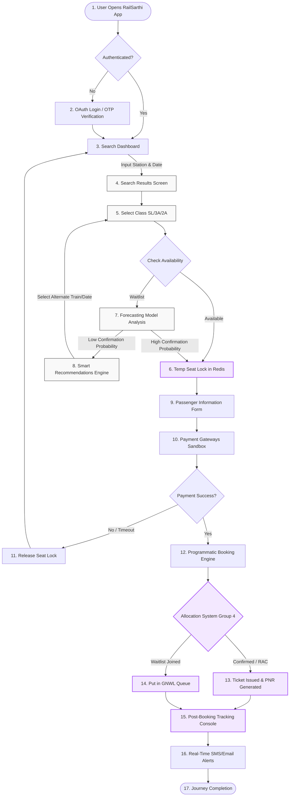

# RailSarthi - End-to-End User Experience & Flow

This document details the user journey and experience flow of the **RailSarthi** platform, detailing how a user interacts with the system from initially searching for a train to post-journey notifications.

---

## 🗺️ User Experience Blueprint (System Flow)

---

## 🚶 Step-by-Step User Experience Walkthrough

### Step 1: Entry & Authentication (Seamless Onboarding)
*   **UX Action:** The user launches the app/web platform. If not logged in, they are greeted by a sleek login page supporting Google OAuth or Fast OTP verification.
*   **System Action:** Retrieves user profiles and active travel history.

### Step 2: Smart Search Dashboard
*   **UX Action:** The user inputs the **Source Station** (e.g., *New Delhi - NDLS*), **Destination Station** (e.g., *Bhopal Habibganj - HBJ*), **Journey Date**, and preferred **Seat Quota** (General/Tatkal/Ladies).
*   **System Action:** Performs an indexed database query against static railway station databases and cached active routes.

### Step 3: Search Results & Confirmation Probability
*   **UX Action:** The user views a list of trains matching their parameters. For class types that are currently waitlisted, RailSarthi displays a prominent percentage chip (e.g., `🟢 92% Confirmation Chance` or `🔴 35% Confirmation Chance`).
*   **System Action:** Runs the **Forecasting Model Engine** which computes probability metrics using historical booking trends, seasonal weights, and current waitlist depth.

### Step 4: Alternative Recommendations (Avoid the Waitlist)
*   **UX Action:** If the selected train has a low confirmation probability, the user is presented with alternative suggestions below the search card:
    *   *Alternative Date:* "Train 12002 has 98% confirmation chance if you travel tomorrow."
    *   *Alternative Station:* "Book from Station A (10km away) where seats are vacant."
    *   *Alternative Connection:* "Book Train X to Station Y, and transfer to Train Z (Guaranteed seats)."

### Step 5: Temporary Seat Locking (Tatkal Protection)
*   **UX Action:** The user selects a travel option and clicks "Book Now."
*   **System Action:** The backend initiates a **10-minute temporary seat lock** in Redis. This secures the physical berths for the user while they fill passenger details and complete the payment, preventing duplicate seating allocations (double-bookings).

### Step 6: Passenger Form & Seating Preferences
*   **UX Action:** The user inputs names, ages, and preferred berths (Lower/Middle/Upper/Side Lower).
*   **System Action (Group 4 Core):**
    *   Flags senior citizens (age >= 60) and ladies to prioritize remaining `LOWER` berths.
    *   Flags multiple passengers under a single transaction to group their allocations close together in the same coach compartment.

### Step 7: Secure Payment Gateway
*   **UX Action:** The user proceeds to the checkout, selecting Razorpay, UPI, or Cards.
*   **System Action:** Once the gateway webhook returns `payment.success`, the transaction changes state from `PENDING` to `CONFIRMED`. If payment fails or times out, the Redis seat lock expires, and the seat is released back to the general pool.

### Step 8: Seat Allocation & Ticket Dispatch
*   **UX Action:** A success screen loads showing a printable digital ticket, PNR status details, and exact Coach and Seat allocation numbers (e.g., `S1 / Seat 24 / LOWER`).
*   **System Action (Group 4 Core):** 
    *   If confirmed seats are full, the system assigns passengers to **RAC** (Reservation Against Cancellation), allocating them to shared Side Lower berths.
    *   If RAC is full, they join the **GNWL** waitlist queue.
    *   Dispatches PDF receipts and SMS/Email tickets via Nodemailer/Twilio pipelines.

### Step 9: Live Post-Booking Tracking
*   **UX Action:** The user can visit their **Active Bookings** board anytime to view real-time updates. If they are waitlisted, they can track their queue moving closer to RAC or CNF.
*   **System Action:** When other passengers cancel their bookings on the same train, a background worker triggers a cascading waitlist promotion, automatically upgrading RAC/WL passengers and immediately sending them an SMS update (e.g., `Your PNR has been upgraded to S1 / Seat 12`).
